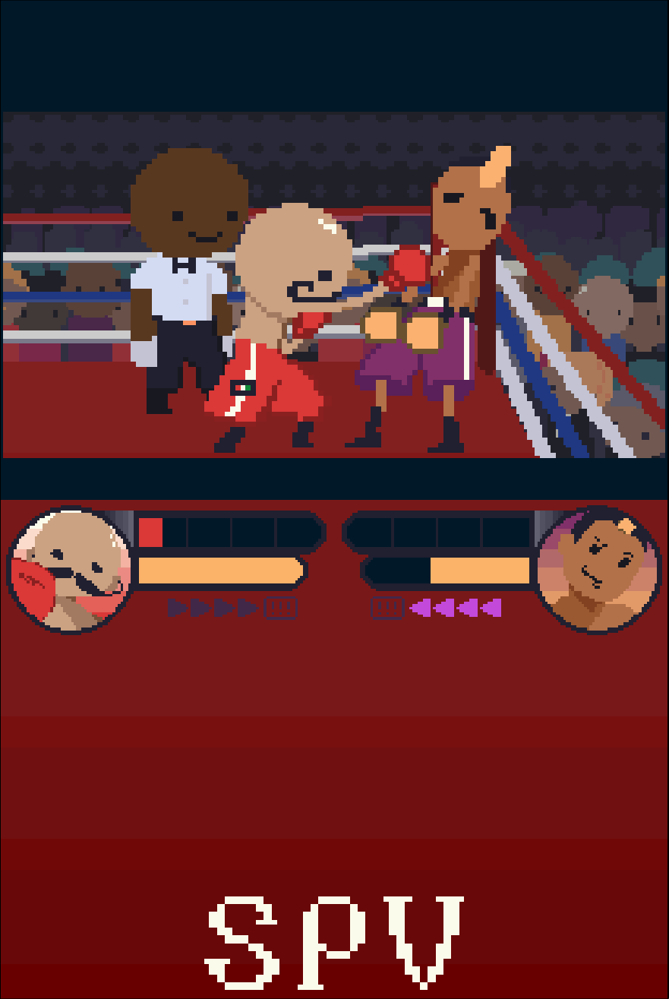
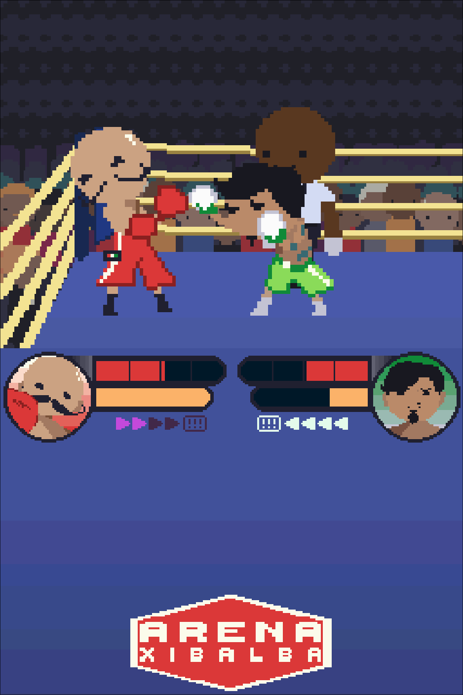
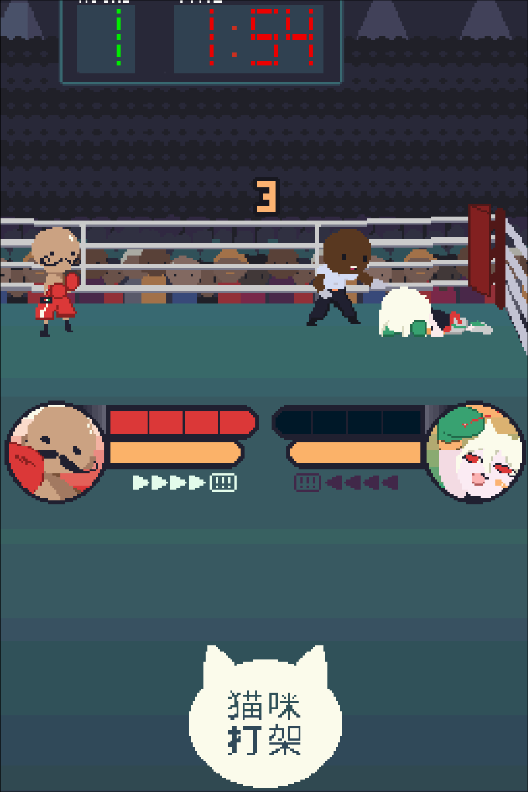
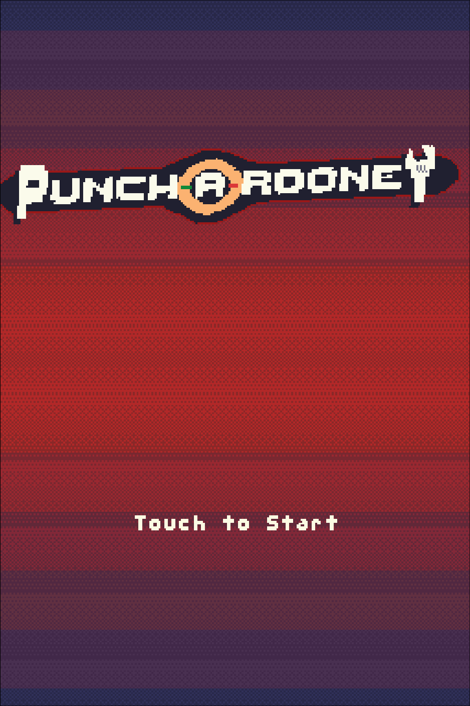
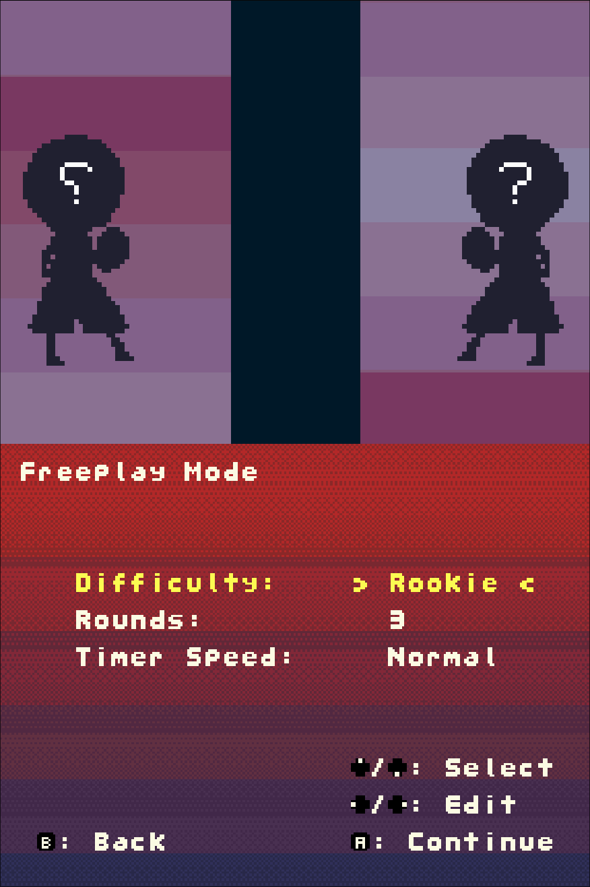
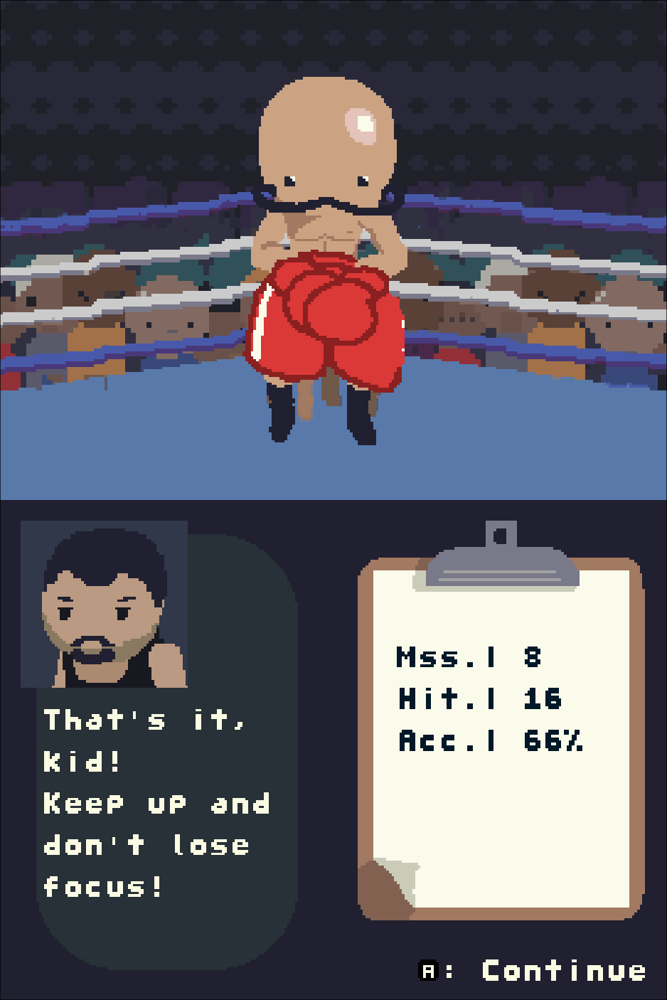

# Punch-A-Rooney
**Punch-A-Rooney**, the homebrew boxing game made for the Nintendo DS

Play as Rooney "Punchstache" Bafutto, a 22-year-old Italian boxer who quits his job as a plumber.
Fight against five fighters, become champion, then defend your title!

Play on your own, or in local multiplayer!

# Screenshots
<table>
<tr>
<td></td>
<td></td>
<td></td>
</tr>
<tr>
<td></td>
<td></td>
<td></td>
</tr>
</table>

# How To Play

Put the ROM on a flashcart and enjoy some sweet dual screen action.

### Emulator

Load the ROM on your favorite emulator! I personally used [melonDS](https://github.com/melonDS-emu/melonDS/releases/latest) a lot during the development of this game.

### 3DS/DSi Modded

This game works on Twilight Menu++ so modded DSi and 3DS users can also enjoy!

I will create a QR code for 3DS players with FBI soon

## Quick Guide

### Controls

- A: Light Punch
- B: Heavy Punch
- X: The Viola (Super Move)

- L: Block
- R: Dodge

### Multiplayer

You'll need two consoles (or melonDS with a multiplayer window)

* Enter Local on both consoles
* Host on one console, then join on the other
* As a host, press A to begin editing your match information

* Press start on the last screen if you're the host to start
* If you are not the host, choose your character quick before the host starts!

**This has been proven to have unexpected latency at times, I will try my best to work on it**

### Save data

Works on hardware and melonDS, but if your emulator does not allow saving the game will work fine.
If your emulator does not support saving, try to use save states!

## Building

### Libraries
I used the libraries provided by [BlocksDS](https://blocksds.skylyrac.net/). Once installed, run make in the directory to create a .nds file.

### Assets
There are a lot of sloppy convert bashes in each asset folder. Run them in order based on "alphabetical order"

## License
The source code for this project is licensed under Apache-2.0, except otherwise stated. For more information, see [LICENSE](https://github.com/WiIIiam278/breaking-bad-ds/blob/main/LICENSE).
